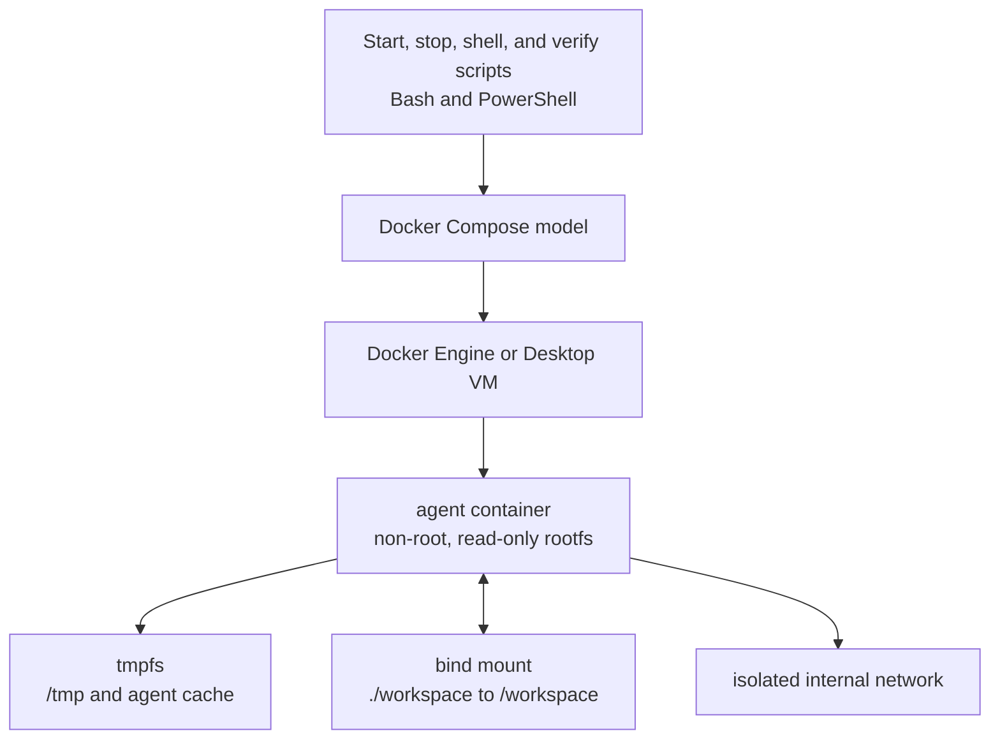
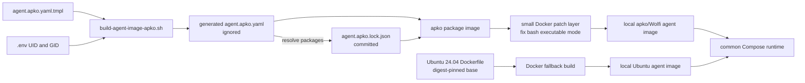

# Container and build view

## Runtime view

There is one long-running service. Its `sleep infinity` command keeps the hardened container available for `docker compose exec`; it is not an application server. The service exposes no port and has no restart policy.

The Compose model is the common enforcement point for both image-build paths. An image already present under `AGENT_IMAGE` is reused. If it is absent, the start scripts build the Dockerfile fallback.

## Image-build view

### apko/Wolfi path

- The template is rendered with the same UID/GID that Compose uses at runtime.
- A normal build refreshes the committed package lock before building.
- `--no-lock` is reserved for reproducing and validating the committed lock.
- apko supplies the minimal package filesystem. A small Docker layer corrects the executable mode of Wolfi's packaged Bash, because this installation path does not run the package trigger that normally performs that correction.
- CI builds and runs this path on native amd64; local builds use the host architecture.

### Ubuntu fallback

- The base image identity is pinned by digest while remaining on Ubuntu 24.04.
- Package installation still resolves against Ubuntu repositories at build time and is therefore less reproducible than the locked apko path.
- It remains available for systems without apko and as a comprehensible recovery path during the transition.

Both outputs must pass the same runtime verification before use.
