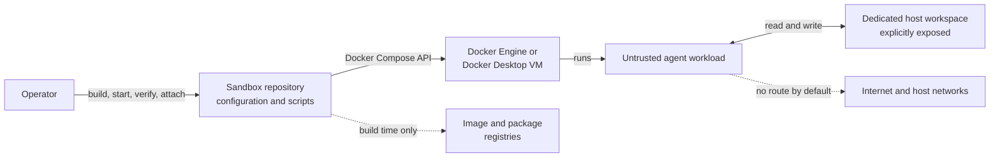

# System context

## Context

The sandbox lets an operator run an LLM-driven or computer-use-related terminal workload against a deliberately narrow host workspace. Docker Compose applies the runtime controls consistently; platform-specific Docker implementations provide the Linux container boundary.

## Actors and responsibilities

| Actor or system | Responsibility | Trust level |
|---|---|---|
| Operator | Reviews changes, selects workspace data, starts and verifies the sandbox | Trusted |
| Repository configuration | Defines image builds, runtime controls, and verification | Trusted and review-controlled |
| Docker Engine/Desktop | Enforces namespaces, cgroups, mounts, network isolation, and security options | Trusted platform dependency |
| Agent workload | Processes prompts and task data and may execute generated commands | Untrusted |
| Workspace | Only persistent host data intentionally exposed to the agent | Exposed; contents are not protected from the agent |
| Registries and package repositories | Supply base images and build-time packages | External supply-chain dependency |

## Trust boundaries

1. **Host to Docker boundary:** native Linux shares the host kernel; Docker Desktop adds a Linux VM boundary. Neither model makes a container an absolute sandbox.
2. **Container to workspace boundary:** `/workspace` is a deliberate read/write crossing. Everything beneath it is considered accessible to the agent.
3. **Container to network boundary:** the Compose network is internal and provides no ordinary route to external networks.
4. **Build-time supply-chain boundary:** image and package inputs are fetched outside the runtime sandbox and must be pinned, locked, reviewed, and rebuilt deliberately.

The detailed threat inventory and out-of-scope cases remain authoritative in the [threat model](../THREAT-MODEL.md).
